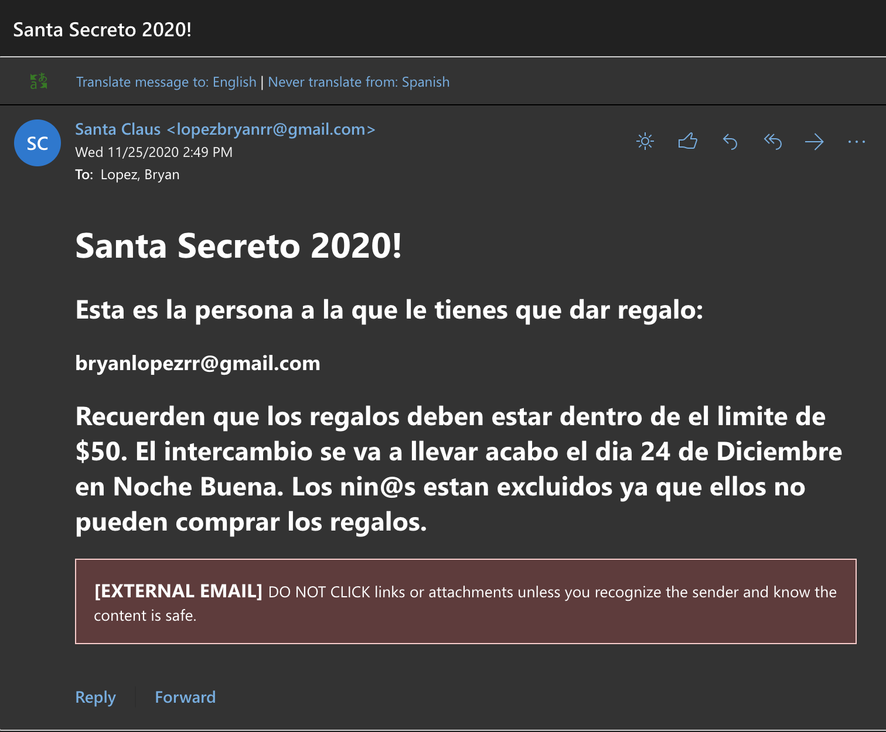
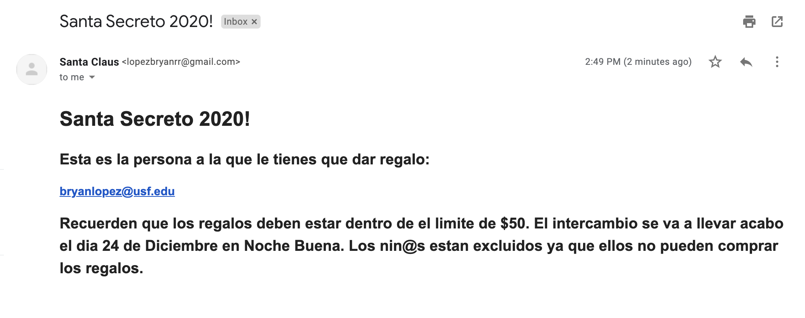

# Secret Santa Console Application - C++

This is a console application that will automate a secret santa gift exchange between a group of 
people. It takes user input and calls a script to send emails with the assignments. 

 IE: A group of 4 people enter there names and emails. The program will run the script that will send
    the appropriate email and assignments. A reference table to know who's email belong to who's name is
    printed on the screen 

Time spent: **8** hours spent in total

## User Stories

The following **required** functionality is completed:

- [x] User can input the amount of participants
- [x] The program validates more than 1 participant joins
- [x] Emails are sent to each individual participant with their assignments
- [x] The console application prints in color for easier readability
- [x] The console prints instructions **inSpanish** for now
- [x] A text file is generated with the assignments but its later deleted to delete trace

## Table Implementation  

### TABLE REFERENCE
 | userName | userEmail |
 | -------- | --------- |

## Dependencies/Libraries 
- Python system call in C++ to run a script that automates emails 
- Termcolor is a header-only C++ library for printing colored messages to the terminal. <a href="https://github.com/ikalnytskyi/termcolor" >Learn more</a>

## Instructions to run the program
- Navigate to file location
- Compile the program using : $ g++ -std=c++17 'nameOfFile.cpp'  -o './nameOfEXE'
- Run the program by executing ./nameOfEXE **email credential** **email password credential** the latter get passed as arguments to the script to log in and perform the operations

## Video Walkthrough

Here's a walkthrough of implemented user stories:

## Screenshots of the emails

